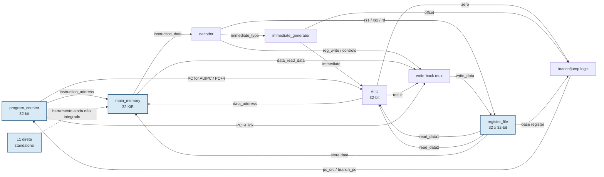

# Auditoria e integração da microarquitetura atual

- Data da auditoria: 2026-09-08
- Referência: [`/CONTEXT.md`](/CONTEXT.md)
- RTL analisado: [`/rtl`](/rtl)
- Testes analisados: [`/tests/vhdl`](/tests/vhdl)

## 1. Resultado executivo

O estado atual é uma **base funcional RV32I single-cycle parcial**, agora com uma
L1 direta reutilizável em RTL e útil como modelo de referência para a próxima
implementação. Ele contém PC, ALU, gerador de imediatos, decoder, banco de
registradores, RAM, núcleo single-cycle e cache.

Ele ainda **não atende ao escopo completo** definido no `CONTEXT.md`. Os itens
mais importantes ausentes são pipeline IF/ID/EX/MEM/WB, forwarding/hazard unit,
I-cache, D-cache, MMIO/FIFOs, extensão M, ponto flutuante F/IEEE 754, CSRs,
snapshots de ciclo, GUI desktop, montador, Docker e regressão arquitetural.

Conclusão: classificar o repositório como **Marco 1 — referência RV32I parcial**,
e não como MVP final. A prioridade é fechar um contrato de ISA e tornar essa
referência verificável antes de transformá-la no núcleo pipeline.

## 2. Conformidade com o escopo

| Demanda do `CONTEXT.md` | Estado | Evidência / lacuna |
|---|---|---|
| RTL em VHDL | Parcialmente atende | Os blocos atuais estão em VHDL-2008-style, mas não há lint/compilação automatizada no repositório. |
| RV32I | Parcialmente atende | Decoder cobre parte das operações inteiras, loads/stores word, branches BEQ/BNE, JAL/JALR, LUI e AUIPC. Não cobre todo RV32I. |
| Núcleo funcional | Base atende | `core_rv32i_single.vhd` integra os blocos em um datapath single-cycle. |
| Pipeline de cinco estágios | Não atende | Não existem registradores IF/ID, ID/EX, EX/MEM, MEM/WB nem unidade de controle temporal. |
| Hazards, forwarding, stalls e flushes | Não atende | O PC possui `pc_write`, mas o núcleo o fixa em `'1'`; não há hazard/forwarding unit. |
| RAM unificada Von Neumann | Parcialmente atende | `main_memory` é uma RAM backing comum, porém a interface tem duas leituras combinacionais e ainda não há cache/controlador de memória. |
| L1 direta | Parcialmente atende | `l1_direct_mapped_cache.vhd` implementa 64 conjuntos, linha de 16 B, tag/valid, refill e métricas; ainda não está integrada ao core e é write-through. |
| I-cache/D-cache finais | Não atende | Falta instanciar I$/D$ no pipeline, definir arbitragem e evoluir a D$ para a política write-back/2-way do escopo. |
| Buffering de I/O | Não atende | Não há MMIO, UART, FIFO RX/TX ou mapa de dispositivos implementado. |
| `RV32M` | Não atende | Não há multiplicador/divisor nem instruções `M`. |
| `RV32F`/IEEE 754 | Não atende | Não há FPR, FPU, `fcsr`, `frm`, `fflags` ou operações binary32. |
| CSRs mínimos / `Zicsr` | Não atende | O package declara `OPCODE_SYSTEM`, mas o decoder marca SYSTEM como inválido. |
| Interface GUI | Não atende | Não há `CycleSnapshot`, exportador de trace, frontend desktop ou esquemático. |
| CLI/TUI headless | Não atende | Ainda não há executável de simulação nem interface de terminal. |
| Montador/carregador | Não atende | A RAM possui uma porta de carregamento, mas não há assembler, parser, símbolos ou CLI de loading. |
| TDD/SDD | Parcialmente atende | Existem `tb_alu.vhd` e `tb_pc_reg.vhd`, mas faltam testes de decoder, imediatos, RAM, register file, núcleo e integração. |
| Docker/CI | Não atende | Não há `Dockerfile`, Compose, workflow ou comando reprodutível de teste. |

## 3. Microcircuitos e comunicação

| Circuito | Função | Entradas principais | Saídas / consumidores |
|---|---|---|---|
| `chimps_pkg.vhd` | Tipos, larguras, opcodes e operações comuns | — | Todos os blocos RTL |
| `pc_reg.vhd` | Estado do PC, `PC+4`, stall e salto | clock, reset, `pc_write`, alvo | RAM de instruções, lógica de próximo PC |
| `imm_gen.vhd` | Decodifica e estende imediatos I/S/B/U/J | instruction, tipo | ALU e cálculo de alvo |
| `alu.vhd` | Aritmética, lógica e comparação | dois operandos, operação | write-back, RAM e branch |
| `decoder.vhd` | Gera controle a partir do encoding | instruction | RF, ALU, RAM e PC |
| `register_file.vhd` | 32 GPRs, duas leituras e uma escrita | endereços rs1/rs2/rd, write-back | ALU, branch e RAM |
| `ram.vhd` | Backing store Von Neumann de 32 KiB | endereços, dados, máscaras | instrução, loads e cache |
| `l1_direct_mapped_cache.vhd` | L1 direta: tag/valid, lookup, refill e write-through | request CPU + memória backing | CPU, RAM e contadores GUI |
| `core_rv32i_single.vhd` | Integração single-cycle da referência | clock, reset, loader | PC, RAM, decoder, RF e ALU |

O `core_rv32i_single` percorre PC → RAM → decoder/RF/imediato → ALU → RAM/write-
back → PC. A L1 já é reutilizável, mas ainda está desacoplada do core: a integração
deve ocorrer por um barramento explícito, não por conexões ad hoc.

## 4. Diagrama da microarquitetura atual

O diagrama representa o caminho integrado atual, não o alvo final. A L1 direta
existe como circuito reutilizável, mas ainda aguarda o barramento para entrar no
caminho PC/RAM do núcleo.



### Comunicação no ciclo atual

| Origem | Destino | Informação | Natureza |
|---|---|---|---|
| PC | RAM | endereço de instrução | combinacional |
| RAM | Decoder | instruction word | combinacional |
| Decoder | RF/ALU/RAM/PC | sinais de controle | combinacional |
| RF | ALU/RAM/branch | operandos e store data | combinacional |
| Immediate generator | ALU/branch | imediato sign-extended | combinacional |
| ALU | RAM/WB/branch | resultado, endereço, zero | combinacional |
| RAM | WB | valor de load | combinacional |
| WB | RF | `rd` e valor de escrita | síncrona no clock |
| PC logic | PC | próximo endereço | síncrona no clock |

## 5. Problemas que devem ser resolvidos antes do pipeline

1. **Fechar o perfil ISA inicial.** Declarar um subconjunto verificável, por
   exemplo `RV32I_CHIMPS_V1 = ADDI, ADD, SUB, AND, OR, XOR, SLT, SLTU, LW, SW,
   BEQ, BNE, JAL, JALR, LUI, AUIPC`. Só chamar de RV32I completo após incluir as
   instruções restantes e seus testes.
2. **Separar instrução ilegal de NOP/trap.** Criar `exception_valid` e `cause`;
   não usar somente `valid` para todos os casos.
3. **Completar a RAM.** Definir acessos LB/LBU/LH/LHU/LW, SB/SH/SW, máscaras,
   alinhamento, latência e erro de endereço. A RAM deve ser backing store, não o
   lugar onde a política de cache fica escondida.
4. **Criar uma interface de memória.** Usar um request/response explícito com
   `valid`, `ready`, `we`, `address`, `wdata`, `wmask`, `rdata`, `error` e
   identificador de origem. Isso permitirá ligar I-cache, D-cache e MMIO sem
   alterar a ISA.
5. **Criar um bundle de controle de pipeline.** Agrupar `valid`, `pc`, instruction,
   `rs1_value`, `rs2_value`, `rd`, immediate, ALU control, memory control e
   write-back control em registros entre estágios.

## 6. Próximos passos de implementação

### Fase A — especificação e verificação da referência

1. Criar `docs/adr/001-vhdl-toolchain.md` e registrar VHDL-2008, GHDL, VUnit ou
   OSVVM, convenções de reset, endianess e política de memória.
2. Criar `specs/isa-rv32i-chimps-v1.md` com tabela de instruções, encodings,
   estados afetados, traps e exemplos de assembly.
3. Adicionar testes para `imm_gen`, decoder, register file e RAM.
4. Criar um testbench do núcleo que carrega words pela porta `load_*` e verifica
   PC, `retired`, stores, loads e branches.
5. Adicionar compilação no Docker/CI. Não iniciar o pipeline sem um teste verde
   da referência single-cycle.

### Fase B — pipeline de cinco estágios

Implementar nesta ordem:

1. Registradores `if_id`, `id_ex`, `ex_mem`, `mem_wb` com reset e `valid`.
2. Divisão do núcleo em IF, ID, EX, MEM e WB, preservando a mesma semântica do
   núcleo single-cycle.
3. `forwarding_unit` para caminhos EX/MEM e MEM/WB.
4. `hazard_unit` para load-use: congelar PC/IF-ID e injetar bolha em ID/EX.
5. Controle de branch/jump em EX com flush preciso de instruções jovens.
6. Testes de trace ciclo a ciclo para ALU→ALU, load→use, branch tomado e store.

### Fase C — memória, cache e I/O

1. Colocar um barramento de memória entre o core e a RAM.
2. Implementar primeiro I-cache direta, read-only, com hit/miss e refill.
3. Implementar D-cache direta com write-through no primeiro marco; só depois
   evoluir para 2-way, write-back e write-allocate.
4. Adicionar MMIO como um destino do barramento, sem colocar lógica UART dentro
   da RAM.
5. Implementar FIFOs RX/TX com `empty`, `full`, `count`, `push`, `pop` e
   backpressure; criar os endereços do mapa de memória no `CONTEXT.md`.
6. Expor contadores de hit, miss, write-back, stalls e latência para a GUI.

### Fase D — definição e integração das extensões ISA

Não adicionar instruções diretamente no decoder sem atualizar a especificação e
os testes. O fluxo para cada extensão deve ser:

```text
ISA spec → encoding/decoder → unidade RTL → mux/controle de pipeline
         → hazards/latência → write-back/estado → testes → trace/GUI
```

- **M:** adicionar `MUL`, `MULH`, `MULHSU`, `MULHU`, `DIV`, `DIVU`, `REM`, `REMU`,
  uma unidade multi-ciclo e sinais `busy/done`.
- **Zicsr:** adicionar `fcsr`/CSRs mínimos e instruções CSR antes do `F`.
- **F:** adicionar FPR, `FLW/FSW`, decoder FP, FPU binary32, `frm`, `fflags`,
  arredondamento, NaN/infinitos/subnormais e modelo SoftFloat no testbench.

Cada unidade multi-ciclo deve bloquear ou permitir avanço conforme um protocolo
explícito; nunca inserir uma espera fixa na GUI ou no testbench para mascarar
latência do RTL.

### Fase E — snapshots e GUI

Depois que o trace do pipeline estiver estável, criar `CycleSnapshot` com PC,
instrução, validade de cada estágio, sinais de barramento, valores de registrador,
estado de cache, stalls, flushes, traps e métricas. A GUI deve consumir esse
contrato, não ler sinais privados nem reimplementar o decoder.

O primeiro vertical slice visual deve mostrar `ADDI` e `LW` passando por PC,
RAM, register file e ALU, com um botão de passo e o barramento destacado. Só
depois adicionar cache, FPU, MMIO e detalhes avançados ao esquemático.

## 7. Critérios para considerar a microarquitetura integrada

- O perfil ISA implementado está escrito e todos os encodings suportados possuem
  testes unitários e de integração.
- O núcleo pipeline produz o mesmo estado arquitetural da referência single-cycle
  para os programas RV32I do subconjunto.
- Cada stall, flush, miss e operação multi-ciclo tem causa e duração observáveis.
- I-cache e D-cache acessam a mesma RAM backing, preservando Von Neumann.
- MMIO/FIFOs não alteram a semântica de loads/stores normais.
- `CycleSnapshot` reproduz um ciclo sem consultar estado oculto.
- GHDL/CI/Docker executam a suíte sem dependências manuais.
- A GUI mostra o caminho CPU↔memória e a TUI/CLI reproduz a mesma execução em
  modo headless.
